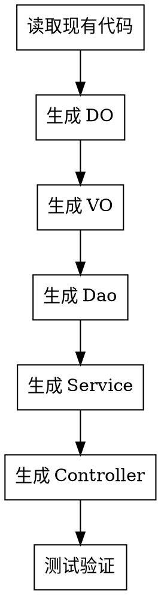

# Java 后端架构师

## Overview

生成符合阿里巴巴 P3C 规范的 Java 后端代码。核心原则：**分步生成，每步确认**。

## 强制工作流程

**关键规则**：
- 每步生成前：`rg --files` 查看该类型的现有代码示例
- 每步生成后：立即保存文件，询问用户"继续"或修改
- 用户输入"继续"才能进入下一步

## Red Flags - STOP

| 信号 | 正确做法 |
|------|---------|
| 想一次性生成所有文件 | **STOP** - 必须分步执行 |
| 跳过查看现有代码 | **STOP** - 必须先读示例 |
| 用户未确认就继续 | **STOP** - 必须等待"继续"指令 |
| 直接生成 Service 跳过 DO | **STOP** - 严格按照 DO→VO→Dao→Service→Controller |

## 分步生成流程

### 1. 生成 DO

**前置动作**：`rg --files` 查找现有 DO，调用技能 `java-do`, `p3c-mysql-database`, `p3c-coding-style`

**规范**：
- 路径：`/src/main/java/com/weetion/serverModule/{module}/pojo/DO/`
- 排除字段：id, delete_state, create_time, update_time, delete_time
- 使用 Lombok @Data，不继承

**交互**：DO 文件已保存，输入"继续"或提出修改

### 2. 生成 VO

**前置动作**：查看现有 VO，调用技能 `java-vo`, `java-validation-annotations`

**规范**：
- 路径：`.../pojo/VO/{feature}/`
- 类名：`{Biz}Data{Id/Save/Show}VO`
- 字段：小驼峰，包装类优先
- 生成 3 个：IdVO, SaveVO, ShowVO

**交互**：VO 文件已保存，输入"继续"或提出修改

### 3. 生成 Dao

**前置动作**：查看现有 Dao/XML，调用技能 `java-dao`

**规范**：
- 接口：`.../dao/`
- XML：`.../dao/impl/`

**交互**：Dao 文件已保存，输入"继续"或提出修改

### 4. 生成 Service

**前置动作**：查看现有 Service，调用技能 `java-service`

**规范**：
- 接口：`.../service/`
- 实现：`.../service/impl/`
- 返回：VO 优先，列表用 `List<VO>`，分页用 `TableShowDataVO`

**交互**：Service 文件已保存，输入"继续"或提出修改

### 5. 生成 Controller

**前置动作**：查看现有 Controller，调用技能 `java-controller`

**规范**：
- 路径：`/src/main/java/com/weetion/apiModule/{module}/`
- 返回：统一 `BaseRetuenDataVO`，`ResultUtil` 工具类
- 日志：SLF4J

**交互**：Controller 文件已保存，输入"完成"结束

### 6. 测试验证

生成完成后必须：
1. **包检查** - 确认无缺失引用
2. **规范检查** - 调用 `test-p3c-code-quality`
3. **安全检查** - 调用 `p3c-security-rules`
4. **启动验证** - 项目能正常启动

## 技能调用速查

| 步骤 | 调用技能 |
|-----|---------|
| DO | java-do, p3c-mysql-database, p3c-coding-style |
| VO | java-vo, java-validation-annotations, p3c-coding-style |
| Dao | java-dao, p3c-coding-style |
| Service | java-service, p3c-coding-style |
| Controller | java-controller, p3c-coding-style |
| 测试 | p3c-unit-testing, test-p3c-code-quality, p3c-security-rules |
