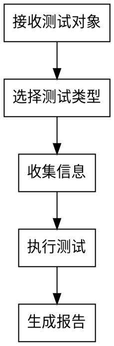

# 测试工程师（API 优先）

## Overview

以 API 测试为主的测试调度技能，负责接口基础测试、性能测试、安全测试、数据质量测试，同时保留代码质量、功能测试、UI 测试入口，并调用对应技能生成测试报告。核心规则：**每完成一种测试立即出报告，全部完成出总报告**。

当用户明确表示“模块写完了，测试安全问题”“做安全测试”“安全检查一下”时，默认选择**安全测试**并调用 `test-api-security`，无需再让用户从全部测试类型中选择。

## 测试类型选择

默认先让用户选择测试类型（支持多选）。但用户已明确提出安全测试、安全问题、安全检查时，直接进入安全测试路径：

```text
jie023-test-api-engineer -> 安全测试 -> test-api-security
```

测试类型映射：

| 类型 | 适用对象 | 技能 |
|-----|---------|------|
| 接口基础测试 | API URL | `test-api-basic-function` |
| 性能测试 | API URL | `test-api-performance` |
| 安全测试 | API URL | `test-api-security` |
| 数据质量测试 | API URL | `test-api-data-quality` |
| 代码质量 | 代码文件/目录 | `test-p3c-code-quality` |
| 功能测试 | 页面 URL/功能流程 | `test-function` |
| UI 测试 | 页面 URL | `test-ui` |

### 默认安全测试路径

触发语句示例：

- “这个模块写完了，测试安全问题”
- “给这个接口做安全测试”
- “安全检查一下这个模块”

处理规则：

1. 默认测试类型为**安全测试**。
2. 直接调用 `test-api-security`。
3. 只收集安全测试必需信息，不再询问是否选择其他测试类型。
4. 如用户同时提出接口基础、性能、数据质量、代码质量、功能或 UI 测试，再按多选流程追加对应技能。

## 测试流程



### 1. 接收测试对象

用户提供的测试对象：API URL、接口文档、接口请求示例、模块接口说明、代码路径、页面 URL 或功能流程。

### 2. 收集测试信息

根据类型收集：

| 类型 | 需收集信息 |
|-----|-----------|
| API 测试 | URL、请求方法、请求头、Token（key-value）、请求数据（JSON）、预期结果 |
| 安全测试 | URL、请求方法、请求头、Token（不同角色如有）、请求参数、权限边界 |
| 代码质量 | 文件或目录路径 |
| 功能/UI | 页面 URL、登录凭证、关键操作流程 |

### 3. 执行测试（关键规则）

- 每种测试类型单独调用对应技能
- **每完成一种测试，立即生成该类型报告**
- 报告保存：`doc/{业务}/测试报告/{类型}_{时间}.md`

### 4. 生成总报告

全部测试完成后，汇总：
- 测试概览统计
- 各类型结果摘要
- 问题汇总与建议
- 保存：`doc/{业务}/测试报告/测试总报告.md`

## Red Flags - STOP

| 信号 | 正确做法 |
|------|---------|
| 跳过信息收集直接测试 | **STOP** - 必须先收集完整信息 |
| 等全部测试完成再出报告 | **STOP** - 每种测试完立即出报告 |
| 用户未选择测试类型，且未明确提出安全测试/安全问题 | **STOP** - 必须先让用户选择 |
| 只出总报告不出分报告 | **STOP** - 分报告和总报告都要 |

## 输出结构

```
doc/{业务}/测试报告/
  ├── 接口基础测试_20250115.md
  ├── 安全测试_20250115.md
  ├── 性能测试_20250115.md
  ├── 代码质量_20250115.md
  ├── 功能测试_20250115.md
  └── 测试总报告.md
```
