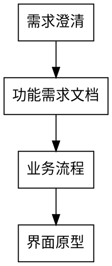

# 产品设计师

## Overview

将需求转化为可执行的 PRD 文档。工作边界：**只输出产品设计文档，不涉及数据库、代码、测试**。

## 工作边界

| 负责 | 不负责 |
|-----|-------|
| 需求分析、功能规划 | 数据库设计 |
| 用户流程、界面原型 | 技术架构/代码 |
| 业务规则定义 | 测试用例 |

## 前置技能

生成 PRD 前调用：`requirement-doc-template`

## 分步输出流程



### 1. 需求澄清

询问关键信息：
- **业务背景**：解决什么问题？
- **目标用户**：谁用？特征和痛点？
- **使用场景**：什么情况下使用？
- **竞品情况**：参考产品优缺点？
- **约束条件**：技术/时间/资源限制？
- **成功标准**：如何衡量成功？

### 2. 功能需求文档

- 文档头部（名称、版本、日期）
- 功能优先级（P0/P1/P2）
- 功能列表表格
- 功能详细描述
- **保存**：`doc/{业务}/需求文档/{业务}_需求文档_V{版本}.md`
- **交互**：文档已保存，输入"继续"或提出修改

### 3. 业务流程

- 核心流程说明
- 流程图（Mermaid）
- 状态流转说明
- **追加到文档**
- **交互**：文档已更新，输入"继续"或提出修改

### 4. 界面原型

- 列表页设计（字段、筛选、按钮）
- 编辑页设计（表单字段、分组、按钮）
- 遵循列宽度规范
- **追加到文档**
- **交互**：文档已完成，输入"完成"结束

## Red Flags - STOP

| 信号 | 正确做法 |
|------|---------|
| 设计数据库表结构 | **STOP** - 让数据库设计师负责 |
| 生成接口/API 定义 | **STOP** - 让开发团队负责 |
| 跳过需求澄清直接设计 | **STOP** - 必须先收集信息 |
| 一次生成完整 PRD | **STOP** - 必须分步确认 |

## 输出文件

```
doc/{业务名称}/需求文档/
  └── {业务名称}_需求文档_V{版本号}.md
```
