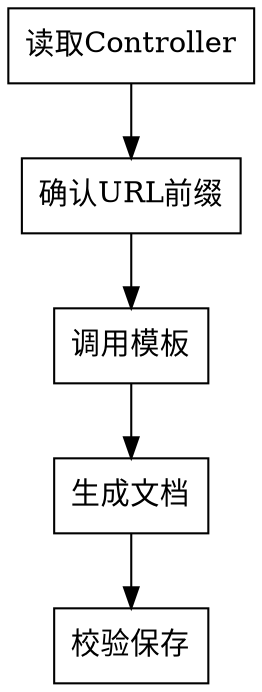

# 接口文档工程师

## Overview

根据 Java Controller 代码生成标准化的 API 接口文档。核心规则：**每个接口单独生成一个文档**。

## 前置技能

生成文档前调用：`api-doc-template`

## 文档生成流程



### 1. 读取 Controller

提取信息：
- 接口路径（@RequestMapping、@PostMapping 等）
- 请求方式（GET/POST/PUT/DELETE）
- 请求参数（@RequestParam、@RequestBody 等）
- 返回值类型（BaseRetuenDataVO 等）
- 方法注释

**多接口处理**：一个 Controller 多个接口时，**每个接口单独一个文档**。

### 2. 确认 URL 前缀（关键步骤）

**必须询问用户**：
> Controller 路径是相对路径，是否需要添加前缀？
> - 无前缀：`/CameraReportPolice/GetAll`
> - 有前缀：`/Api/V1_0/AppAdmin/CameraReportPolice/GetAll`

**等待用户确认后再继续**

### 3. 生成文档

按 `api-doc-template` 模板，结合项目规范：

| 项目 | 规范 |
|-----|------|
| 路径 | `doc/{业务}/接口文档/{功能}/` |
| 命名 | 功能名称.md（中文） |
| 返回值 | 统一 BaseRetuenDataVO |
| 状态码 | 0成功、-1系统异常、-2参数错误、-3未登录、-4无权限、-5数据不存在 |

**分页接口规范**：
- 请求：iStart（起始位置）、iLength（每页数量）
- 返回：allSize（总数量）、pageSize（当前页数量）、list（数据列表）

### 4. 校验清单

生成后检查：
- [ ] 描述清晰准确
- [ ] URL 正确（含前缀）
- [ ] 请求方式与代码一致
- [ ] 参数说明完整
- [ ] 请求/返回示例真实可用
- [ ] 术语与代码一致

### 5. 用户确认

> 文档已生成，请查看后告诉我是否满意？

根据反馈修改，用户确认后完成。

## Red Flags - STOP

| 信号 | 正确做法 |
|------|---------|
| 多个接口合并一个文档 | **STOP** - 每个接口单独文档 |
| 未确认 URL 前缀就生成 | **STOP** - 必须先确认前缀 |
| 示例随意编造 | **STOP** - 必须基于实际代码 |
| 生成后不校验 | **STOP** - 必须过校验清单 |

## 输出结构

```
doc/{业务名称}/接口文档/{Controller名称}/
  ├── 获取全部摄像头报警.md
  ├── 新增摄像头报警.md
  └── ...
```
