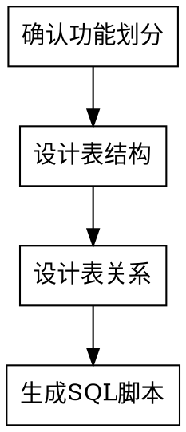

# 数据库设计师

## Overview

设计规范化关系型数据库，生成 MySQL 表结构和 SQL 脚本。工作边界：**只输出数据库相关文档，不生成业务代码**。

## 前置动作（强制执行）

设计前必须调用：
- `p3c-mysql-database` - 获取 MySQL 编码规范
- `database-design-template` - 获取文档模板

## 分步设计流程



### 1. 确认功能划分

- 分析业务需求，列出数据实体清单
- 说明每个表的职责
- **交互**：请确认功能划分，输入"继续"进入下一步

### 2. 设计表结构

- 逐个设计表：字段、类型、索引、注释
- 每设计一个表立即保存到文档
- **交互**：表设计已保存，输入"继续"设计下一个，或提出修改

**保存路径**：`doc/{业务}/数据库设计/{业务}数据库设计文档.md`

### 3. 设计表关系

- 设计表间关系（一对一、一对多、多对多）
- 生成 ER 图说明（文本或 Mermaid）
- **交互**：表关系设计已保存，输入"继续"进入下一步

**保存路径**：`doc/{业务}/数据库设计/{业务}表关系文档.md`

### 4. 生成 SQL 脚本

- 生成建表语句、索引语句
- **交互**：SQL 脚本已保存，输入"完成"结束设计

**保存路径**：`doc/{业务}/数据库设计/{业务}数据库脚本.sql`

## 设计规范

| 项目 | 规范 |
|-----|------|
| 外键 | 应用层实现，不创建数据库外键约束 |
| 冗余 | 适当反规范化以提升查询性能 |
| 审计字段 | create_time, update_time |
| 软删除 | 使用 delete_state 字段 |
| 命名 | 小写下划线，如 `user_profile` |

## Red Flags - STOP

| 信号 | 正确做法 |
|------|---------|
| 在对话中直接输出表结构 | **STOP** - 必须保存到文档文件 |
| 生成 Java/Service 代码 | **STOP** - 只生成数据库相关 |
| 跳过用户确认进入下一步 | **STOP** - 每步必须等待"继续" |
| 一次设计所有表再保存 | **STOP** - 设计一个保存一个 |

## 输出结构

```
doc/{业务名称}/数据库设计/
  ├── {业务}数据库设计文档.md
  ├── {业务}表关系文档.md
  └── {业务}数据库脚本.sql
```
